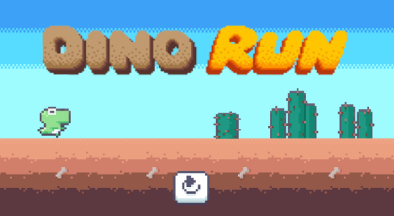
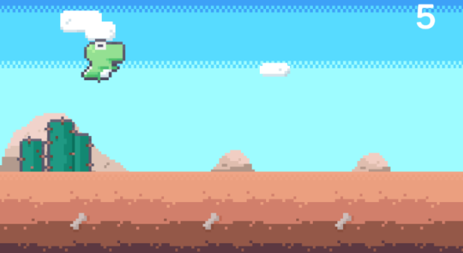
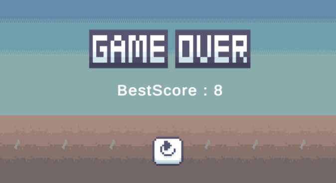

## Dinorun

This project is conducted to study C# and Unity.

## Stack

- Unity
- C#


## How to play

You can run this game throught the file path below.

```
Dinorun_play/DinoRun.exe
```


## Game Play


<div align="center">
    
    
    
</div>


## Use Game Source

- Character Asset: https://assetstore.unity.com/packages/2d/characters/bolt-2d-dinorun-assets-pack-188721
- Title Asset : https://sysrqmts.com/ko/prices/dino-run-dx
- Background Music : https://bgmstore.net/
- Sound Effect : https://www.youtube.com/shorts/gNpmzpJ4Ro0

